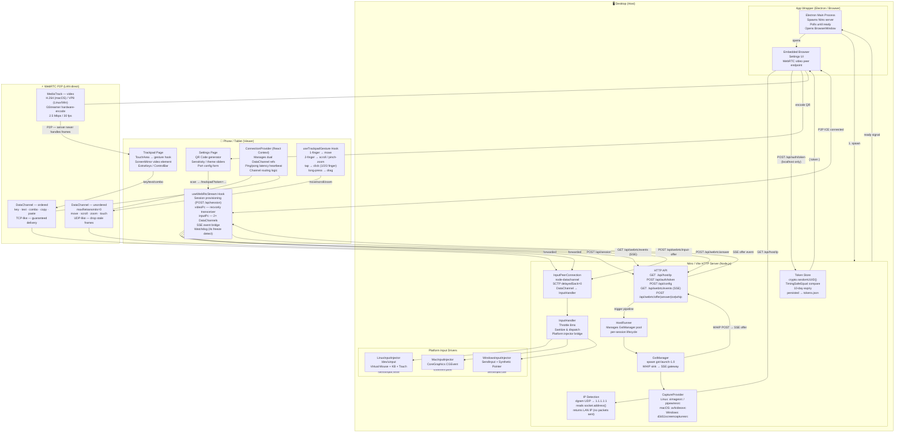

# Architecture Overview

Rein is built on a **layered, peer-to-peer architecture** designed around a single principle: *all high-frequency data flows directly between the phone and the desktop — the server is only a signaling broker*.

---

## System Diagram



---

## Key Architectural Decisions

### 1. Two Separate WebRTC Peer Connections

Rein intentionally uses **two distinct `RTCPeerConnection` objects** per session:

| Connection | Purpose | Channels |
|---|---|---|
| `videoPc` | Receives the GStreamer screen capture | 1× `recvonly` video transceiver |
| `inputPc` | Carries input events from phone to desktop | 2× DataChannels (ordered + unordered) |

This split avoids the overhead of DTLS/ICE for DataChannels on the same connection that also carries a heavy video track, and enables the input path to connect **before the video pipeline is ready**.

### 2. Dual DataChannel Design

| Channel | Config | Used For |
|---|---|---|
| `input-unordered` | `ordered: false, maxRetransmits: 0` | `move`, `scroll`, `zoom`, `touch` |
| `input-ordered` | `ordered: true` | `key`, `text`, `combo`, `copy`, `paste` |

Mouse movement is UDP-like — stale frames are useless. Keyboard events must be reliable. The `ConnectionProvider` context automatically routes each event type to the correct channel, with fallback to the other if one is unavailable.

### 3. SSE as a Lightweight Signaling Bus

Rather than using a dedicated WebSocket server, the signaling channel is implemented as a **Server-Sent Events (SSE)** stream over the same Vite/Nitro HTTP server. Events pushed through `pushEvent()` carry:

- `offer` — GStreamer SDP offer (video)
- `answer` — browser SDP answer (video)
- `host-ice` / `viewer-ice` — ICE candidates for video
- `input-answer` — server SDP answer to input offer
- `input-ice` — ICE candidates for input
- `stream-error` — pipeline failure notifications
- `session-closed` — session teardown

### 4. WHIP for GStreamer → Browser Signaling

GStreamer does not speak the WebRTC browser signaling protocol natively. Rein uses the **WHIP (WebRTC-HTTP Ingestion Protocol)** standard: GStreamer's `whipclientsink` element POSTs its SDP offer to `/api/webrtc/whip`, and the server polls for the browser's answer, then sends it back. This is the "server-side" half of the video peer connection.

### 5. No External STUN/TURN Servers

All communication is **LAN-only** — no ICE servers are configured (`iceServers: []`). This is intentional: Rein is a local-first tool and makes a strong privacy guarantee that no data ever leaves your network.

### 6. Input Throttling at 8ms

The `InputHandler` applies a per-type throttle (default 8ms ≈ 125 Hz) on `move` and `scroll` events. Pending events are coalesced rather than dropped — the last event in a burst is always dispatched. Combined with `delayedSackTime: 0` on the SCTP layer, this achieves sub-frame input latency without flooding the DataChannel.

---

## Boot Sequence (Step by Step)

```
1. npm run dev / Electron app.whenReady()
   └─ Vite dev server starts on port 3000 (or configured port)
   └─ Electron spawns Nitro production server, polls HTTP until ready

2. Browser opens localhost:3000/settings
   └─ Settings page loads
   └─ Calls GET /api/host/ip → reads LAN IP via dgram UDP trick
   └─ Calls POST /api/auth/token (localhost-only) → generates/returns token
   └─ Encodes QR: http://<LAN_IP>:<PORT>/trackpad?token=<TOKEN>

3. User scans QR with phone
   └─ /trackpad page loads on phone
   └─ useWebRtcStream: POST /api/session → gets sessionId
   └─ Opens SSE: GET /api/webrtc/events?sessionId=...
   └─ Creates videoPc (recvonly) and inputPc (DataChannels)
   └─ Sends POST /api/webrtc/input-offer (inputPc SDP)

4. Server receives session creation
   └─ Calls ensureHostRunnerActive()
   └─ HostRunner creates GstManager for this sessionId
   └─ GstManager.start() → CaptureProvider.initialize()
   └─ Spawns gst-launch-1.0 with WHIP sink

5. GStreamer WHIP handshake
   └─ POST /api/webrtc/whip?sessionId=...  (GStreamer offer)
   └─ Server pushes "offer" event on SSE
   └─ Browser answers → POST /api/webrtc/answer
   └─ Server's WHIP handler resolves with SDP answer → GStreamer connected

6. Input DataChannel handshake
   └─ Server creates InputPeerConnection (node-datachannel)
   └─ Processes inputPc offer → creates answer
   └─ Pushes "input-answer" event on SSE → browser adds remote description

7. All channels open — system is live
   └─ Touch gestures → DataChannel → InputHandler → OS driver
   └─ GStreamer frames → MediaTrack → <video> element on phone
```

---

## Component Responsibilities (Quick Reference)

| Component | File | Responsibility |
|---|---|---|
| HTTP Router | `src/server/server.ts` | Route matching, `AsyncLocalStorage` context, error handling |
| API Handlers | `src/server/api/apiHandlers.ts` | All REST endpoint logic |
| API State | `src/server/api/apiState.ts` | Shared in-memory state (sessions, SSE clients, runner) |
| Token Store | `src/server/tokenStore.ts` | Token CRUD, timing-safe compare, file persistence |
| Input PC | `src/server/api/InputPeerConnection.ts` | node-datachannel peer, SCTP tuning, InputHandler bridge |
| Input Handler | `src/server/InputHandler.ts` | Validation, throttle, dispatch to platform injector |
| Host Runner | `src/server/gstreamer/hostRunner.ts` | GstManager pool lifecycle |
| Gst Manager | `src/server/gstreamer/gstManager.ts` | gst-launch-1.0 spawn, WHIP integration, fallback |
| Capture Provider | `src/server/gstreamer/captureProvider.ts` | Platform capture source factory |
| Linux Driver | `src/server/drivers/linux/index.ts` | /dev/uinput virtual devices |
| macOS Driver | `src/server/drivers/mac/index.ts` | CoreGraphics CGEvent injection |
| Windows Driver | `src/server/drivers/windows/index.ts` | SendInput + Synthetic Pointer API |
| Connection Provider | `src/contexts/ConnectionProvider.tsx` | React context: dual DC routing, ping/pong |
| useWebRtcStream | `src/hooks/useWebRtcStream.ts` | Full WebRTC lifecycle, reconnect, watchdog |
| useTrackpadGesture | `src/hooks/useTrackpadGesture.ts` | Touch gesture state machine |
| Settings Page | `src/routes/settings.tsx` | QR generation, token fetch, config UI |
| Trackpad Page | `src/routes/trackpad.tsx` | Main remote control UI |
| Electron Main | `electron/main.cjs` | App wrapper, server spawn, BrowserWindow |
